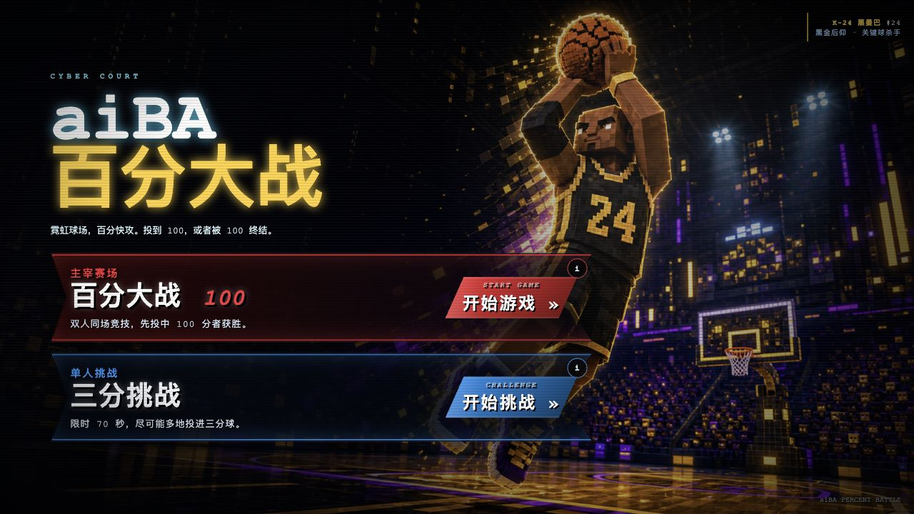

# aiBA Percent Battle / aiBA·百分大战



一个浏览器里的 3D 篮球投篮小游戏。个人作品，持续迭代中。

在线试玩：

https://opstiger.github.io/aiba-percent-battle/

## 模式

- 百分大战：两人同时开投，先到 100 分获胜。
- 三分挑战：限时单人三分赛。

## 操作

- 按住屏幕蓄力，松开投篮。
- 视觉先锋版可在难度页选择“视觉实验”，用上半身投篮动作蓄力与出手。
- 百分大战中，点击场上点位或用左右方向键移动。
- 手机浏览器需要先点一下页面或右上角声音按钮来解锁音频，这是移动端浏览器的自动播放限制。

## 本地运行

不需要构建，直接启动静态服务：

```bash
python3 -m http.server 4174
```

然后打开：

```text
http://127.0.0.1:4174/
```

## 项目结构

- `index.html`：当前可玩的入口文件。
- `block-3pt-kingv1.36-vision-alpha.html`：当前实验版本快照。
- `assets/`：游戏图片、视频和音频资源。
- `vendor/`：随项目带的第三方运行文件，包括 Three.js 与 MediaPipe Tasks Vision。
- `backup/`：本地历史版本归档，不参与发布。
- `docs/`：本地需求与迭代文档，不参与发布。

## 说明

项目还在快速迭代，所以 README 只保留稳定信息，不维护详细 changelog。具体版本变化以 Git 历史为准。

Three.js 按其 MIT License 使用。项目生成的图片资源默认随本项目使用，除非后续另有说明。
第三方音频的来源与独立许可见 [`assets/aiba-audio/SOURCE.md`](assets/aiba-audio/SOURCE.md)。
视觉模型来源与许可见 [`assets/aiba-vision/SOURCE.md`](assets/aiba-vision/SOURCE.md)。

## License

MIT. See `LICENSE`.
